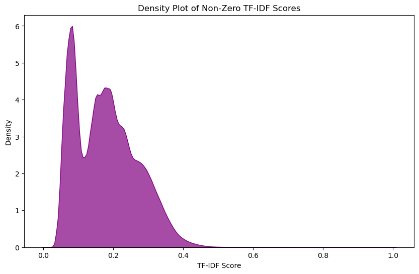

# Password Strength Classification Using Machine Learning

This repository contains a comprehensive machine learning project focused on classifying password strength using a variety of feature engineering techniques and model architectures. The project explores synthetic password datasets to understand how different password features correlate with security strength, using metrics such as entropy, character composition, and token-based representations.

## 📂 Repository Structure

- `fully_modified_synthetic_hacking_data.csv` — Preprocessed dataset with engineered features.
- `Final_Report.ipynb` — Main Jupyter notebook with full preprocessing, model training, and evaluation pipeline.
- `Recurrent_Neural_Network_(RNN).ipynb` — Separate notebook exploring sequence-based RNN modeling.
- `Final_Report.html` — Rendered report (viewable in-browser).
- `README.md` — This file.
- `images/` — Contains key visualizations.
- `.gitignore` — Python cache and environment exclusions.
- `requirements.txt` — All required packages to run the notebooks.

## 🧠 Project Summary

This project evaluates how various password characteristics contribute to strength classification, both from an interpretable feature perspective and through deep learning. The dataset includes entropy scores, character counts, and token-level patterns. The following machine learning models were implemented and compared:

- Logistic Regression
- Random Forest Classifier
- Gradient Boosting
- Recurrent Neural Network (RNN) with LSTM units

### 🔍 Core Tasks:

- Preprocessing & Feature Engineering:
  - Count uppercase/lowercase/digit/special characters
  - Calculate Shannon entropy
  - Identify common patterns like sequences and repeated characters
- TF-IDF Vectorization for token analysis
- RNN implementation for sequential pattern modeling
- Performance evaluation: Accuracy, F1 Score, ROC AUC

## 📊 Visualizations

### Password Strength Grouping by Entropy


### TF-IDF Density Distribution


### Feature Importance: Tree-Based Models


## 💡 Key Results

- **Entropy and character diversity** were the most predictive features.
- Gradient Boosting slightly outperformed Random Forest on accuracy.
- RNNs captured subtle sequential patterns but required more data for generalization.
- TF-IDF added marginal improvement in tree-based models when combined with entropy features.

## 💾 Getting Started

### 🔧 Installation

Create and activate a virtual environment (optional but recommended):

```bash
python3 -m venv venv
source venv/bin/activate  # On Windows: venv\Scripts\activate
```

Install required packages:

```bash
pip install -r requirements.txt
```

### ▶️ Usage

Open either notebook to get started:

```bash
jupyter notebook Final_Report.ipynb
# or
jupyter notebook Recurrent_Neural_Network_(RNN).ipynb
```

To view the static report:

```bash
open Final_Report.html  # macOS/Linux
start Final_Report.html  # Windows
```

## 📁 Dataset Info

The dataset was synthetically generated for academic analysis of password behavior and contains no real user data. Labels represent a strength scale (0 = weak, 1 = medium, 2 = strong).

## 🖼 Example Output

The repository contains the following artifacts:

- Decision boundaries and feature importance plots
- Entropy distributions
- RNN sequential predictions
- TF-IDF feature effects

## 🔒 Ethical Considerations

This project is for **educational** purposes only. The techniques developed here are meant to improve understanding of data security and should never be used maliciously or for unethical password inference.

## 📜 License

MIT License — Free to use, modify, and distribute with proper attribution.
